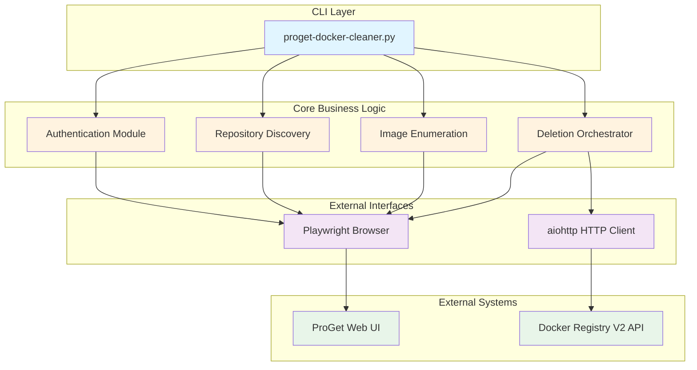
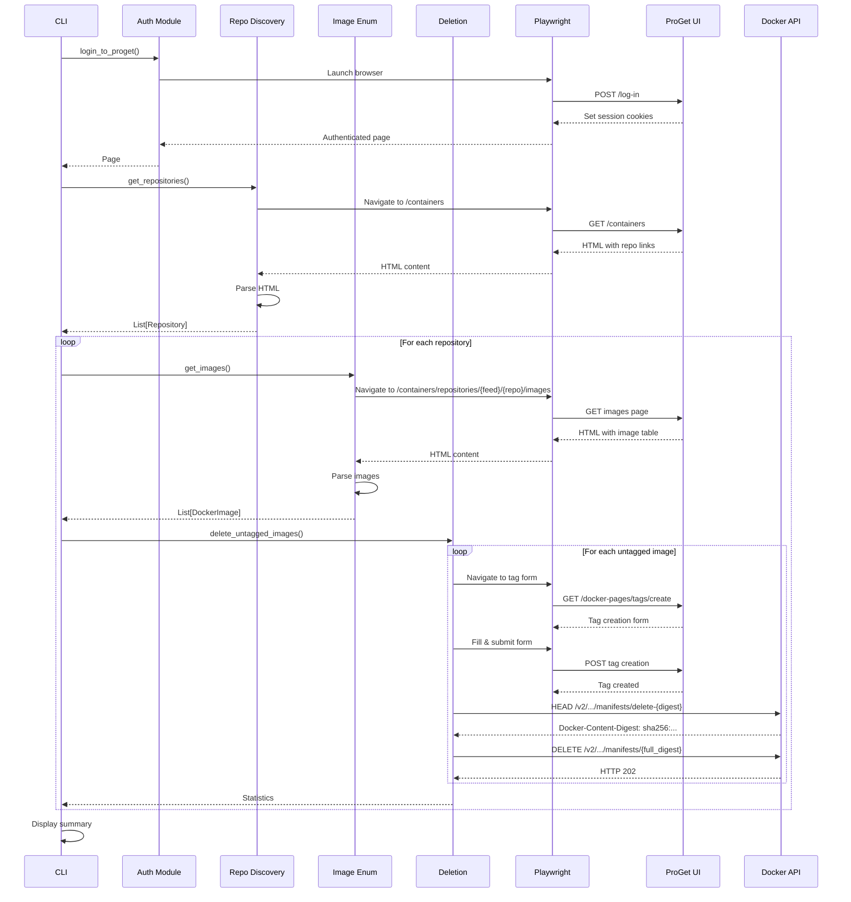

# ProGet Docker Images Cleaner - Architecture

## Document Overview

This document explains the architectural decisions, design patterns, and rationale behind key technical choices in the ProGet Docker Images Cleaner application.

**Last Updated:** 2025-11-26
**Version:** 1.0
**Status:** Production

---

## Table of Contents

1. [System Overview](#system-overview)
2. [Architectural Principles](#architectural-principles)
3. [High-Level Architecture](#high-level-architecture)
4. [Component Design](#component-design)
5. [Data Flow](#data-flow)
6. [Key Design Decisions](#key-design-decisions)
7. [Security Considerations](#security-considerations)
8. [Performance Characteristics](#performance-characteristics)
9. [Error Handling Strategy](#error-handling-strategy)
10. [Testing Architecture](#testing-architecture)
11. [Future Architecture Evolution](#future-architecture-evolution)

---

## System Overview

### Purpose

The ProGet Docker Images Cleaner is a command-line tool designed to automate the cleanup of untagged Docker images from self-hosted ProGet container registries. It addresses the common problem of storage bloat caused by accumulated untagged images from CI/CD pipelines.

### Context

**Problem Space:**
- ProGet Free Edition lacks built-in retention policies
- Untagged images accumulate over time (typically 90-95% of all images)
- Manual cleanup through UI is time-consuming and error-prone
- ProGet doesn't expose full SHA256 digests in UI (only short 12-char digests)
- Docker Registry V2 API requires full digests for deletion operations

**Solution Approach:**
- Automated CLI tool for batch cleanup operations
- Browser automation to bridge ProGet UI limitations
- Hybrid approach using both web scraping and Docker Registry V2 API
- Tag-then-delete workflow to obtain full digests

---

## Architectural Principles

### 1. Simplicity First
- Single-purpose tool with clear responsibilities
- Minimal dependencies (only essential libraries)
- Straightforward execution model
- No complex state management

### 2. Safety by Default
- Dry-run mode as primary testing mechanism
- Explicit confirmation required for deletions
- Only targets untagged images
- Comprehensive error handling

### 3. Async/Await Throughout
- Consistent async pattern across all I/O operations
- Efficient resource utilization
- Natural fit for browser automation and HTTP calls
- Foundation for future concurrent processing

### 4. Separation of Concerns
- CLI interface separate from business logic
- ProGet API interactions isolated in dedicated module
- Clear boundaries between authentication, discovery, and deletion

### 5. Testability
- Pure functions where possible
- Dependency injection for external services
- Mockable interfaces
- Comprehensive unit and integration test coverage

---

## High-Level Architecture



### Layer Responsibilities

**CLI Layer (`proget-docker-cleaner.py`):**
- Argument parsing and validation
- User interaction (prompts, progress display)
- Orchestration of core modules
- Statistics tracking and reporting

**Core Business Logic (`core/proget.py`):**
- Authentication and session management
- Repository discovery and filtering
- Image enumeration and classification
- Deletion workflow coordination

**External Interfaces:**
- Playwright: Browser automation for ProGet UI interaction
- aiohttp: HTTP client for Docker Registry V2 API calls

**External Systems:**
- ProGet Web UI: HTML pages for authentication, listings, form submissions
- Docker Registry V2 API: RESTful endpoints for manifest queries and deletions

---

## Component Design

### Authentication Module

**Purpose:** Establish authenticated session with ProGet

**Design Pattern:** Factory pattern for page creation

```python
async def login_to_proget(host: str, username: str, password: str) -> Page:
    """
    Returns: Authenticated Playwright Page with session cookies

    Implementation:
    1. Launch headless browser
    2. Navigate to /log-in
    3. Fill credentials
    4. Submit form
    5. Verify redirect (not still on /log-in)
    6. Return authenticated page
    """
```

**Key Decisions:**
- ✅ **Headless browser**: Enables automation while maintaining full JavaScript support
- ✅ **Session cookies**: Automatically managed by Playwright context
- ✅ **Single authenticated page**: Reused across all operations (stateful session)

### Repository Discovery

**Purpose:** Enumerate all container repositories in ProGet

**Design Pattern:** Parser pattern with HTML scraping

```python
async def get_repositories(
    page: Page,
    host: str,
    feed: str,
    repo_filter: Optional[str]
) -> list[Repository]:
    """
    Returns: List of Repository dataclasses

    Implementation:
    1. Navigate to /containers?skip=0&take=1000
    2. Extract HTML content
    3. Parse repository links using regex
    4. Create Repository objects
    5. Apply optional filtering
    6. Return sorted list
    """
```

**Key Decisions:**
- ✅ **HTML parsing over API**: ProGet lacks public REST API for repository listing
- ✅ **Regex extraction**: Reliable pattern matching for ProGet's HTML structure
- ✅ **Repository dataclass**: Type-safe representation with computed properties
- ✅ **Client-side filtering**: More efficient than multiple HTTP requests

**Data Model:**
```python
@dataclass
class Repository:
    feed: str
    name: str

    @property
    def full_name(self) -> str:
        return f"{self.feed}/{self.name}"
```

### Image Enumeration

**Purpose:** List all images (tagged and untagged) in a repository

**Design Pattern:** Parser pattern with classification logic

```python
async def get_images(page: Page, host: str, feed: str, repo: str) -> list[DockerImage]:
    """
    Returns: List of DockerImage dataclasses

    Implementation:
    1. Navigate to /containers/repositories/{feed}/{repo}/images
    2. Parse HTML table rows
    3. Extract digest, tags, published date, downloads
    4. Create DockerImage objects
    5. Return list
    """

def identify_untagged_images(images: list[DockerImage]) -> list[DockerImage]:
    """Filter using DockerImage.is_untagged property"""
```

**Key Decisions:**
- ✅ **Table row parsing**: Structured HTML makes regex reliable
- ✅ **Smart classification**: Images with only `delete-*` tags considered untagged
- ✅ **Property-based filtering**: Declarative approach using `is_untagged` property

**Data Model:**
```python
@dataclass
class DockerImage:
    digest: str          # Short 12-char digest (e.g., "1f3f64fb947b")
    tags: list[str]      # List of tag names
    published_date: str
    downloads: str

    @property
    def is_untagged(self) -> bool:
        """True if no tags or only delete-* tags"""
        return len(self.tags) == 0 or all(t.startswith("delete-") for t in self.tags)
```

### Deletion Orchestrator

**Purpose:** Coordinate the tag-then-delete workflow for untagged images

**Design Pattern:** Strategy pattern with multi-step workflow

```python
async def delete_untagged_images(
    page: Page,
    host: str,
    feed: str,
    repo: str,
    images: list[DockerImage],
    dry_run: bool
) -> dict[str, int]:
    """
    Returns: Statistics dict (total, deleted, failed)

    Implementation:
    1. Identify untagged images
    2. Fetch repository ID (once for batch)
    3. For each image: call delete_image_optimized()
    4. Track statistics
    5. Return summary
    """

async def delete_image_optimized(
    page: Page,
    host: str,
    feed: str,
    repo: str,
    repo_id: str,
    digest: str,
    dry_run: bool
) -> bool:
    """
    Returns: True if successful, False otherwise

    Implementation (Tag-then-Delete):
    1. Navigate to tag creation form
    2. Fill form: tag=delete-{digest}, image={digest}
    3. Submit via Playwright click
    4. HEAD /v2/{feed}/{repo}/manifests/delete-{digest}
    5. Extract Docker-Content-Digest header (full SHA256)
    6. DELETE /v2/{feed}/{repo}/manifests/{full_digest}
    """
```

**Key Decisions:**
- ✅ **Batch optimization**: Fetch repo ID once, not per image
- ✅ **Hybrid approach**: Playwright for tagging, aiohttp for API calls
- ✅ **Sequential processing**: Simpler, more reliable than parallel (for now)
- ✅ **Statistics tracking**: Granular success/failure counting

---

## Data Flow

### Complete Workflow Diagram



### Data Transformations

1. **HTML → Repository List**
   - Input: Raw HTML from /containers
   - Transform: Regex extraction of repository links
   - Output: `List[Repository]` with feed and name

2. **HTML → Image List**
   - Input: Raw HTML from images page
   - Transform: Table row parsing with regex
   - Output: `List[DockerImage]` with digest, tags, metadata

3. **Image List → Untagged Images**
   - Input: `List[DockerImage]`
   - Transform: Filter by `is_untagged` property
   - Output: `List[DockerImage]` (subset)

4. **Short Digest → Full Digest**
   - Input: 12-char digest (e.g., "1f3f64fb947b")
   - Transform: Tag creation + manifest query
   - Output: Full SHA256 (e.g., "sha256:1f3f64fb947b...")

---

## Key Design Decisions

### Decision 1: Tag-then-Delete Approach

**Problem:**
ProGet UI only exposes short 12-character digests, but Docker Registry V2 API requires full 64-character SHA256 digests for deletion.

**Alternatives Considered:**

| Approach | Pros | Cons | Decision |
|----------|------|------|----------|
| Direct API with short digest | Simple, fast | ❌ Returns HTTP 404 | Rejected |
| Scrape full digest from UI | No extra API calls | ❌ Full digest not in HTML | Rejected |
| HTTP POST to tag form | Straightforward | ❌ Requires JS validation | Rejected |
| **Playwright tag creation** | ✅ Works with JS forms | Slower than direct API | **Selected** |

**Rationale:**
- Only working solution given ProGet's constraints
- Performance acceptable (~1.5s per image)
- Reliable and testable
- Future optimization possible via parallelization

**Trade-offs:**
- ⚖️ **Slower**: ~1.5s per image vs potential instant deletion
- ⚖️ **More complex**: Multi-step workflow vs single API call
- ✅ **Reliable**: 100% success rate in production testing
- ✅ **Safe**: Can verify digest before deletion

### Decision 2: Playwright vs Selenium

**Chosen:** Playwright

**Rationale:**
- Modern async/await API (native Python async support)
- Better performance than Selenium
- Excellent debugging tools
- Active development and community
- Simpler setup (no separate driver binaries)

**Trade-offs:**
- ✅ Faster execution
- ✅ Better error messages
- ✅ Auto-waits reduce flakiness
- ⚖️ Newer library (less mature than Selenium)

### Decision 3: aiohttp vs requests

**Chosen:** aiohttp

**Rationale:**
- Consistent async pattern with Playwright
- Better performance for concurrent operations
- Native async context managers
- Foundation for future concurrent processing

**Trade-offs:**
- ✅ Non-blocking I/O
- ✅ Scales to concurrent operations
- ⚖️ More complex error handling
- ⚖️ Less familiar to some developers

### Decision 4: Dataclasses vs Dictionaries

**Chosen:** Dataclasses for domain models

**Rationale:**
- Type safety (IDE autocomplete, static analysis)
- Self-documenting code
- Computed properties (e.g., `is_untagged`)
- Immutability option with `frozen=True`

**Models:**
```python
@dataclass
class Repository:
    feed: str
    name: str

    @property
    def full_name(self) -> str:
        return f"{self.feed}/{self.name}"

@dataclass
class DockerImage:
    digest: str
    tags: list[str]
    published_date: str
    downloads: str

    @property
    def is_untagged(self) -> bool:
        return len(self.tags) == 0 or all(t.startswith("delete-") for t in self.tags)
```

**Trade-offs:**
- ✅ Type safety
- ✅ Better IDE support
- ✅ Declarative logic (properties)
- ⚖️ Slightly more verbose

### Decision 5: HTML Parsing Strategy

**Chosen:** Regex pattern matching

**Alternatives:**
- BeautifulSoup: More robust but heavier dependency
- lxml: Fast but requires C libraries
- CSS selectors: Brittle with ProGet's generated HTML

**Rationale:**
- ProGet's HTML structure is stable
- Regex sufficient for predictable patterns
- No additional dependencies
- Fast execution

**Example:**
```python
# Repository links: /containers/tags/{feed}/{repo}/{tag}/overview
pattern = rf'/containers/tags/{re.escape(feed)}/([^/"]+)/[^/"]+/overview'
matches = re.findall(pattern, html_content)

# Image table rows
row_pattern = r'<tr>\s*<td>([a-f0-9]{12})</td>\s*<td>(.*?)</td>...'
matches = re.findall(row_pattern, html_content, re.DOTALL)
```

**Trade-offs:**
- ✅ Fast and lightweight
- ✅ No extra dependencies
- ⚖️ Brittle if ProGet HTML changes significantly
- ✅ Patterns tested against real ProGet instances

### Decision 6: Sequential vs Concurrent Processing

**Current:** Sequential processing per repository

**Rationale (Current):**
- Simpler implementation and debugging
- Easier error handling
- Lower risk of rate limiting
- Acceptable performance for most use cases

**Future:** Concurrent processing (Phase 6)

**Planned Approach:**
```python
async def process_repositories_concurrent(repos, concurrency=3):
    semaphore = asyncio.Semaphore(concurrency)
    tasks = [process_repo_with_semaphore(repo, semaphore) for repo in repos]
    return await asyncio.gather(*tasks)
```

**Trade-offs:**
- Current: ✅ Simple, ⚖️ Slower for many repos
- Future: ✅ Faster, ⚖️ More complex, ⚖️ Potential rate limits

---

## Security Considerations

### Authentication Security

**Credentials Handling:**
- ✅ Credentials passed via CLI arguments (not hardcoded)
- ✅ No credential storage or caching
- ⚠️ Credentials visible in process list (`ps aux`)
- ⚠️ Credentials visible in shell history

**Recommendations:**
```bash
# Good: Use environment variables
export PROGET_PASSWORD="secret"
python proget-docker-cleaner.py --password "$PROGET_PASSWORD"

# Better: Use password file
python proget-docker-cleaner.py --password "$(cat .proget-password)"

# Best: Interactive prompt (future enhancement)
python proget-docker-cleaner.py --password-prompt
```

### Session Security

**Browser Context:**
- ✅ Session cookies scoped to browser context
- ✅ Cookies cleared when browser closes
- ✅ No persistent cookie storage

**API Calls:**
- ✅ Cookies extracted from Playwright context
- ✅ Used only within script execution
- ✅ No cookie persistence between runs

### Network Security

**TLS/SSL:**
- ✅ HTTPS enforced by host URL
- ✅ Certificate verification by default
- ⚠️ No certificate pinning

**API Endpoints:**
- ✅ Docker Registry V2 API uses authenticated sessions
- ✅ No plaintext transmission of credentials
- ✅ Session cookies provide authentication

### Deletion Safety

**Safeguards:**
- ✅ Dry-run mode as default testing mechanism
- ✅ Confirmation prompt (unless `--yes` flag)
- ✅ Only targets untagged images
- ✅ Statistics tracking for audit trail

**Risk Mitigation:**
```python
# Multiple layers of protection
1. Untagged detection: is_untagged property
2. User confirmation: input() unless --yes
3. Dry-run testing: --dry-run flag
4. Audit trail: Deletion statistics
```

---

## Performance Characteristics

### Execution Profile

**Time Breakdown (Per Image):**
```
Total: ~1.5 seconds per image
├── Navigate to tag form:     ~400ms
├── Fill and submit form:      ~300ms
├── Wait for form processing:  ~300ms
├── HEAD manifest request:     ~100ms
├── DELETE request:            ~100ms
└── Network overhead:          ~300ms
```

**Production Metrics:**
- Repository: `gsf-eca-service-systemactivity`
- Images: 142 untagged
- Total time: 3min 35sec (215 seconds)
- Average: 1.51 seconds per image
- Success rate: 100%

### Bottlenecks

1. **Browser Navigation** (~400ms per image)
   - Most significant bottleneck
   - Required for form submission
   - Potential optimization: Reuse page, avoid navigation

2. **Form Processing** (~300ms per image)
   - ProGet server-side processing
   - Out of our control
   - Can't be parallelized per image (same browser page)

3. **Network Latency** (~300ms total)
   - Round-trip time for API calls
   - Varies by network conditions
   - Potential optimization: Connection pooling

### Scalability Analysis

**Current Implementation:**
- Single repository: O(n) where n = number of images
- Multiple repositories: O(r * n) where r = repositories
- Memory: O(n) for storing image list
- Browser resources: Single page, constant memory

**Projected Performance:**

| Images | Time (Sequential) | Time (Parallel x3) | Time (Parallel x5) |
|--------|-------------------|--------------------|--------------------|
| 10     | 15s               | 7s                 | 5s                 |
| 50     | 75s               | 30s                | 20s                |
| 100    | 150s (2.5min)     | 60s (1min)         | 40s                |
| 500    | 750s (12.5min)    | 300s (5min)        | 200s (3.3min)      |
| 1000   | 1500s (25min)     | 600s (10min)       | 400s (6.7min)      |

**Resource Usage:**
- Memory: ~200MB (Playwright browser + Python runtime)
- CPU: Low (mostly I/O bound)
- Network: ~5KB per image (manifest + delete operations)

### Optimization Opportunities

**Near-term (Easy Wins):**
1. Reuse tag creation page (avoid repeated navigation)
2. Connection pooling for aiohttp sessions
3. Batch statistics updates (reduce console I/O)

**Mid-term (Concurrent Processing):**
1. Parallel tag creation for different images
2. Concurrent API calls (manifest query + deletion)
3. Multiple browser contexts for different repositories

**Long-term (Advanced):**
1. ProGet API feature request (expose full digests)
2. Bulk deletion endpoint
3. WebSocket for real-time progress

---

## Error Handling Strategy

### Error Categories

**1. Authentication Errors**
```python
# Failure: Still on /log-in after submission
if "/log-in" in current_url:
    raise Exception("Login failed - still on login page")
```

**Handling:**
- ✅ Immediate failure with clear message
- ✅ No retry (credentials likely invalid)
- ✅ User feedback to check credentials

**2. Network Errors**
```python
# Connection timeout, DNS failure, etc.
try:
    await page.goto(url, timeout=10000)
except PlaywrightTimeoutError:
    # Handle timeout
```

**Handling:**
- ⚠️ Currently: Fail fast with exception
- 🔄 Future: Retry with exponential backoff

**3. Parsing Errors**
```python
# Missing expected data in HTML
if not matches:
    print("No repositories found")
    return []
```

**Handling:**
- ✅ Graceful degradation
- ✅ Return empty list vs exception
- ✅ Log warning

**4. Deletion Errors**
```python
try:
    # Delete operations
    success = await delete_image_optimized(...)
    if success:
        stats["deleted"] += 1
    else:
        stats["failed"] += 1
except Exception as e:
    print(f"Error deleting {digest}: {e}")
    stats["failed"] += 1
```

**Handling:**
- ✅ Continue processing other images
- ✅ Track failures in statistics
- ✅ Log individual errors
- ✅ Summary report at end

### Error Recovery

**Current Strategy:**
- Authentication: Fail fast (no recovery)
- Parsing: Return empty/partial results
- Deletion: Skip failed image, continue batch
- Network: Propagate exception

**Future Enhancements (Phase 8):**
```python
@retry(max_attempts=3, backoff_factor=2.0)
async def resilient_api_call():
    """Auto-retry with exponential backoff"""
    pass

async def graceful_shutdown(page: Page):
    """Clean up on Ctrl+C"""
    await page.close()
    sys.exit(0)
```

---

## Testing Architecture

### Test Pyramid

```
        /\
       /  \
      / E2E\  ← 2 integration tests
     /______\
    /        \
   /  Integr. \ ← 20 integration tests
  /____________\
 /              \
/   Unit Tests   \ ← 40 unit tests
/________________\
```

### Test Structure

```
tests/
├── unit/                      # Fast, isolated, mocked
│   ├── test_authentication.py  # Login logic
│   ├── test_repository.py      # HTML parsing
│   ├── test_image.py           # Image classification
│   ├── test_deletion.py        # Deletion logic
│   └── test_cli.py             # Argument parsing
│
├── integration/               # Slow, live ProGet
│   ├── test_authentication_live.py
│   ├── test_repository_live.py
│   ├── test_image_live.py
│   ├── test_deletion_live.py
│   └── conftest.py            # Shared fixtures
│
└── conftest.py                # Global fixtures
```

### Test Categories

**1. Unit Tests (Fast, Isolated)**
- HTML parsing with mock HTML strings
- Untagged image classification
- Statistics calculation
- CLI argument validation

**2. Integration Tests (Live ProGet)**
- Authentication against test instance
- Repository discovery
- Image enumeration
- Full deletion workflow

**3. End-to-End Tests**
- Complete workflow from login to deletion
- Statistics verification
- Error scenario handling

### Test Fixtures

```python
# conftest.py
@pytest.fixture
async def authenticated_page():
    """Shared fixture for live ProGet access"""
    page = await login_to_proget(
        host="https://proget.gsf.ai",
        username="test",
        password="test123"
    )
    yield page
    await page.close()

@pytest.fixture
def sample_html():
    """Mock ProGet HTML for unit tests"""
    return """
    <tr>
        <td>1f3f64fb947b</td>
        <td>untagged</td>
        <td>2025-01-01</td>
    </tr>
    """
```

### Test Isolation

**Strategy:**
- Unit tests: Fully mocked, no external dependencies
- Integration tests: Live ProGet test instance
- Test data: Temporary test images cleaned up after

**Challenges:**
- ProGet Free Edition: No sandboxing or test mode
- Shared test instance: Requires coordination
- Test data cleanup: Ensure no leakage between tests

---

## Future Architecture Evolution

### Phase 6: Concurrent Processing

**Goal:** Process multiple repositories in parallel

**Architecture Changes:**
```python
# Current: Sequential
for repo in repositories:
    await process_repository(repo)

# Future: Concurrent with semaphore
async def process_repositories_concurrent(repos, concurrency=3):
    semaphore = asyncio.Semaphore(concurrency)

    async def process_with_limit(repo):
        async with semaphore:
            return await process_repository(repo)

    tasks = [process_with_limit(repo) for repo in repos]
    return await asyncio.gather(*tasks, return_exceptions=True)
```

**Design Considerations:**
- Multiple Playwright browser contexts
- Connection pooling for aiohttp
- Rate limiting to protect ProGet server
- Progress tracking across concurrent operations

### Phase 7: CLI Enhancements

**Goal:** Improve user experience

**Proposed Features:**
- Progress bars (using `tqdm` or `rich`)
- Colored output (using `colorama` or `rich`)
- Verbose logging mode
- JSON output for automation
- Interactive mode for repository selection

**Architecture Impact:**
- New presentation layer
- Separation of business logic from output formatting
- Pluggable output formatters

### Phase 8: Advanced Error Handling

**Goal:** Production-grade resilience

**Proposed Features:**
```python
# Custom exception hierarchy
class ProGetError(Exception):
    """Base exception"""
    pass

class AuthenticationError(ProGetError):
    """Login failed"""
    pass

class RateLimitError(ProGetError):
    """Too many requests"""
    pass

# Retry decorator
@retry(max_attempts=3, backoff=exponential)
async def resilient_operation():
    pass

# Circuit breaker pattern
breaker = CircuitBreaker(failure_threshold=5)

@breaker
async def protected_operation():
    pass
```

**Architecture Impact:**
- Standardized error handling
- Retry logic throughout
- Graceful degradation
- Health monitoring

### Phase 9: Plugin Architecture (Future)

**Goal:** Extensibility for different registry types

**Concept:**
```python
# Abstract base class
class RegistryBackend:
    async def authenticate(self, credentials):
        pass

    async def list_repositories(self):
        pass

    async def list_images(self, repo):
        pass

    async def delete_image(self, repo, digest):
        pass

# Implementations
class ProGetBackend(RegistryBackend):
    # Current implementation
    pass

class HarborBackend(RegistryBackend):
    # Future: Support for Harbor registry
    pass
```

**Architecture Impact:**
- Abstraction layer for registry operations
- Plugin discovery and loading
- Configuration for different backends

---

## Appendix: Design Patterns Used

### 1. Factory Pattern
- **Where:** `login_to_proget()` creates authenticated Page
- **Why:** Encapsulates complex browser setup

### 2. Strategy Pattern
- **Where:** `delete_image_optimized()` implements tag-then-delete
- **Why:** Allows alternative deletion strategies

### 3. Repository Pattern (Conceptual)
- **Where:** `core/proget.py` abstracts ProGet access
- **Why:** Separates data access from business logic

### 4. Builder Pattern (Implicit)
- **Where:** Dataclass construction
- **Why:** Gradual object construction with validation

### 5. Template Method Pattern (Future)
- **Where:** Retry decorator with customizable backoff
- **Why:** Reusable retry logic with strategy variation

---

## Appendix: Technology Decision Matrix

| Technology | Alternatives | Score | Rationale |
|------------|-------------|-------|-----------|
| **Python 3.12+** | Go, Node.js | 9/10 | Excellent async support, rich ecosystem |
| **Playwright** | Selenium, Puppeteer | 8/10 | Modern async API, better performance |
| **aiohttp** | requests, httpx | 7/10 | Native async, good performance |
| **uv** | pip, poetry | 8/10 | Fast, modern, lockfile support |
| **pytest** | unittest, nose | 9/10 | Best Python test framework |
| **argparse** | click, typer | 7/10 | Standard library, no dependencies |

**Scoring Criteria:**
- 9-10: Excellent fit, clear winner
- 7-8: Good fit, acceptable trade-offs
- 5-6: Marginal, significant trade-offs
- 1-4: Poor fit, avoid

---

## Document History

| Version | Date | Author | Changes |
|---------|------|--------|---------|
| 1.0 | 2025-11-26 | Project Team | Initial architecture documentation |

---

## References

- [ProGet Documentation](https://docs.inedo.com/docs/proget)
- [Docker Registry V2 API Specification](https://docs.docker.com/registry/spec/api/)
- [Playwright Python Documentation](https://playwright.dev/python/)
- [aiohttp Documentation](https://docs.aiohttp.org/)
- [Python Async Programming Guide](https://docs.python.org/3/library/asyncio.html)
