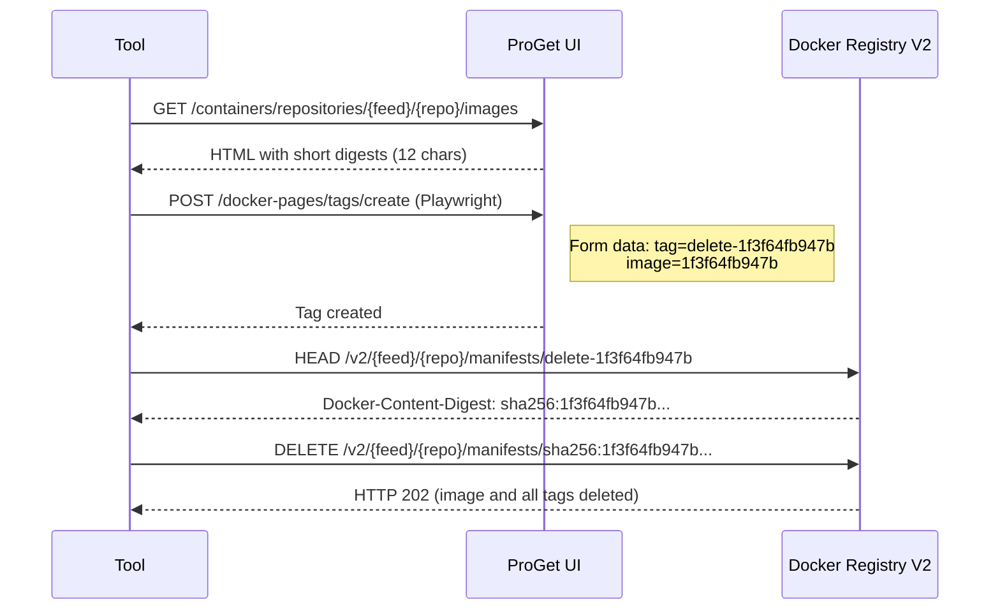

# ProGet URLs

This document lists all HTTP endpoints used by the cleanup tool, grouped by purpose (login, listing repositories, querying images, tagging, deleting).
Useful for debugging, extending the tool, or onboarding new developers.

## 1. Authentication
**POST** `/log-in`

**Purpose:** Authenticate and create a login session.
**Method:** POST
**Form fields:**
- Username
- Password
- button ("Log In")

## 2. List All Container Repositories
**GET** `/containers?skip=0&take=1000`

**Purpose:** Retrieve the list of all container repositories in ProGet UI.
**Method:** GET
**Response:** HTML page containing repository links

## 3. List Images in a Repository
**GET** `/containers/repositories/<feed>/<repo>/images`

**Purpose:** Retrieve all images (tagged + untagged) for a specific repository.
**Method:** GET
**Response:** HTML table with image data

**Example:**
```
/containers/repositories/feed123/api-service/images
```

**Extracted data:**
- Short digest (12 chars, e.g., `1f3f64fb947b`)
- Tag names (if any)
- Published date
- Downloads

**Note:** Untagged images appear as "(untagged)" in the UI. Only short 12-character digests are available in the HTML.

## 4. Create Tag (Tag-then-Delete Approach)
**POST** `/docker-pages/tags/create?repositoryId=<repo_id>`

**Purpose:** Create a temporary tag for an untagged image to enable full digest retrieval.
**Method:** POST (via Playwright form automation)
**Form fields:**
- `AHAntiCsrfToken`: CSRF token (extracted from form)
- `ah0~ah4~ah0`: Tag name (e.g., `delete-1f3f64fb947b`)
- `ah0~ah5~ah0`: Image identifier (short digest, e.g., `1f3f64fb947b`)
- `ah0~ah7~ah0`: Submit button value

**Example:**
```
POST /docker-pages/tags/create?repositoryId=1022
Form Data:
  ah0~ah4~ah0=delete-1f3f64fb947b
  ah0~ah5~ah0=1f3f64fb947b
```

**Note:** This endpoint is accessed via Playwright browser automation, not direct HTTP POST, because it requires JavaScript form validation.

## 5. Get Full Digest from Tag Manifest (Docker Registry V2 API)
**HEAD** `/v2/<feed>/<repo>/manifests/<tag>`

**Purpose:** Retrieve the full SHA256 digest from a tag's manifest.
**Method:** HEAD
**Headers:**
- `Accept: application/vnd.docker.distribution.manifest.v2+json`

**Response headers:**
- `Docker-Content-Digest: sha256:<64-char-hash>`

**Example:**
```
HEAD /v2/feed123/api-service/manifests/delete-1f3f64fb947b
Response Headers:
  Docker-Content-Digest: sha256:1f3f64fb947bc6a4c9c2946e8c33f346f2124c0058f2e20a657aa7fcdd91d18b
```

## 6. Delete Image by Digest (Docker Registry V2 API)
**DELETE** `/v2/<feed>/<repo>/manifests/<digest>`

**Purpose:** Delete an image using its full SHA256 digest.
**Method:** DELETE

**Example:**
```
DELETE /v2/deef123/api-service/manifests/sha256:1f3f64fb947bc6a4c9c2946e8c33f346f2124c0058f2e20a657aa7fcdd91d18b
```

**Response:** HTTP 200 or 202 on success

**Note:** Deleting an image automatically removes all its tags, including temporary tags created during the deletion process.

## Endpoint Summary Table
| Purpose                  | Method | URL                                             | Notes                                        |
| ------------------------ | ------ | ----------------------------------------------- | -------------------------------------------- |
| Login                    | POST   | `/log-in`                                       | Required to get session cookies              |
| List repositories        | GET    | `/containers?skip=0&take=1000`                  | HTML parsing                                 |
| List images              | GET    | `/containers/repositories/<feed>/<repo>/images` | HTML parsing, extracts short digests         |
| Create temporary tag     | POST   | `/docker-pages/tags/create?repositoryId=<id>`   | Playwright form automation required          |
| Get full digest from tag | HEAD   | `/v2/<feed>/<repo>/manifests/<tag>`             | Docker Registry V2 API                       |
| Delete image             | DELETE | `/v2/<feed>/<repo>/manifests/<digest>`          | Docker Registry V2 API, requires full SHA256 |

## Tag-then-Delete Workflow

The deletion process requires multiple API calls because ProGet only exposes short 12-character digests in the UI:



## Key Insights

1. **Short vs. Full Digests**: ProGet UI only shows 12-character short digests, but Docker Registry V2 API requires full 64-character SHA256 digests.

2. **Tag Creation via Playwright**: The tag creation endpoint requires JavaScript form validation, so direct HTTP POST doesn't work. Playwright browser automation is needed.

3. **Temporary Tag Pattern**: Using `delete-{short_digest}` as the temporary tag name makes it easy to identify and allows for idempotent operations.

4. **Automatic Tag Cleanup**: When deleting an image by its full digest, Docker Registry V2 API automatically removes all associated tags, including temporary ones.
